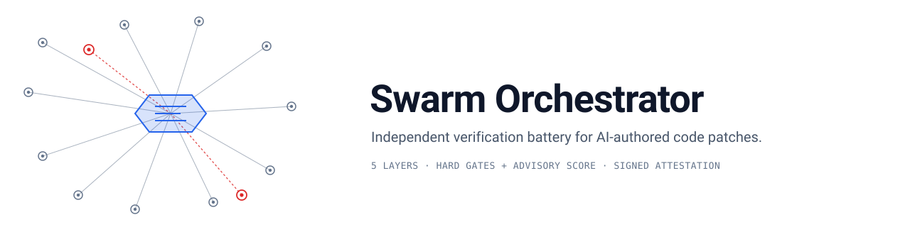

<div align="center">



# Swarm Orchestrator

**Independent verification battery for patches written by AI coding agents.**

[](LICENSE)
[](package.json)
[](package.json)
[](https://github.com/moonrunnerkc/swarm-orchestrator/actions/workflows/ci.yml)
[](https://github.com/moonrunnerkc/swarm-orchestrator/stargazers)

[Quick Start](#quick-start) · [How It Works](#how-it-works) · [Documentation](#documentation) · [Contributing](#contributing)

</div>

---

> Wraps third-party coding-agent CLIs (Copilot, Claude Code, Codex), runs worker and reviewer steps on isolated git branches, and applies a five-layer falsification battery to each agent-authored patch. Hard gates block patches that fail intent or regression checks; advisory layers feed a composite score.

You run this around an agent CLI, not instead of one. The agent produces the patch; the orchestrator tries to break it. Patches that survive merge to `main`; patches that don't are rolled back with a verification report.

## Features

- **Five-layer falsification battery.** Intent verification, regression and mutation testing, cheat detection, property-based testing, and signed attestation. Layers 1 and 2 are hard gates; layers 3 to 5 feed an advisory composite score. Implementations live under `src/verification/`.
- **Isolated worker and reviewer steps.** Each step runs on its own git branch and worktree. Worker writes; reviewer is read-only and synthesises differential tests or reviews the diff against an active policy.
- **Analyzer-gated parallelism.** A static dependency analyser (`src/scheduling/dependency-analyzer.ts`) decides which steps can run in parallel. The planner does not declare independence.
- **Quality-gate engine.** Nine built-in gates (`scaffoldDefaults`, `duplicateBlocks`, `hardcodedConfig`, `readmeClaims`, `testIsolation`, `runtimeChecks`, `accessibility`, `testCoverage`, `testFileProtection`) registered in `src/quality-gates/registry.ts`. Projects register custom gates via `.swarm/gates/index.js`.
- **Signed attestation.** In-toto SLSA v1.0 attestation, cosign keyless via Fulcio plus OIDC, attached as a git note. Implementation: `src/verification/attestation.ts` and `cosign-attestation.ts`.
- **Audit-ready run artifacts.** Every execution writes `runs/<execution-id>/` with `session-state.json`, `metrics.json`, `cost-attribution.json`, per-step `share.md` transcripts, and per-step verification reports. Secrets are redacted at end of run.
- **Multiple agent backends.** Adapters for Copilot CLI, Claude Code, Codex, and Claude Code Teams behind a shared process supervisor.

## Quick Start

### Prerequisites

| Requirement | Version | Notes |
|---|---|---|
| [Node.js](https://nodejs.org/) | >= 20 | Engines-enforced. CI runs 20 and 22. |
| [git](https://git-scm.com/) | >= 2.40 | Worktrees are required; older git is not tested. |
| One agent CLI | latest | One of: `copilot`, `claude`, `codex`. Must be installed and authenticated separately. |
| [Docker](https://www.docker.com/) | latest | Optional. Required only for SWE-bench evaluation containers. |

### Install

```bash
npm install -g swarm-orchestrator
```

Or build from source:

```bash
git clone https://github.com/moonrunnerkc/swarm-orchestrator.git
cd swarm-orchestrator
npm install
npm run build
npm link
```

### First run

```bash
swarm run --goal "Add a /health endpoint that returns 200 OK" \
  --tool claude-code --target ./my-repo
```

Expected output shape:

```text
[cli:swarm] Total Steps: 3
[cli:swarm] Cost Estimate: 3-5 premium requests
[orchestrator] Starting Parallel Swarm Execution
[orchestrator]   Step 1 (worker) on branch: swarm/<run-id>/step-1-worker
[orchestrator]   Step 1 (worker) - Agent working...
[orchestrator]   Step 1 verified, merging...
[cli:swarm] SWARM EXECUTION COMPLETE
[cli:swarm]   Completed: 3/3
[cli:swarm]   Artifacts: ./runs/<run-id>/
```

## How It Works

The CLI takes a goal, calls `swarm bootstrap` or `swarm plan` to produce a plan file, then `swarm swarm <planfile>` runs each step. A worker step is a git branch and worktree where the configured agent CLI executes against the goal; the worker writes a `/share` transcript and commits its changes. A reviewer step is read-only, runs either before the worker (synthesises a differential test from the goal's `FAIL_TO_PASS` description) or after (reviews the diff against a configured policy: general, security, or accessibility).

After each step, the verifier runs. The active per-step path is `src/verifier-engine.ts`, which parses the transcript, cross-references hook-recorded file evidence, and runs outcome checks (`git_diff`, `file_existence`, `build_exec`, `test_exec`) against the worktree. The v7 falsification battery code lives under `src/verification/` and is wired in for differential gating, mutation testing, cheat detection, property testing, and attestation; the migration to make it the sole per-step path is in progress.

Steps that pass verification merge to `main` via octopus merge; steps that fail are rolled back. After all step branches merge, the nine-gate quality engine scans the merged result and writes a report. Quality-gate findings are advisory in the current code: they do not block the merge path.

For deeper detail, see [`ARCHITECTURE.md`](ARCHITECTURE.md) and [`docs/verification.md`](docs/verification.md).

## Supported Agents

| Agent CLI | Status | Notes |
|---|---|---|
| `copilot` | shipped | GitHub Copilot CLI. Cold-start spawn per step. Adapter: `src/adapters/copilot-adapter.ts`. |
| `claude-code` | shipped | Anthropic Claude Code CLI. Supports persistent interactive sessions. Adapter: `src/adapters/claude-code-adapter.ts`. |
| `claude-code-teams` | shipped | Claude Code in teams configuration. Adapter: `src/adapters/claude-code-teams.ts`. |
| `codex` | shipped | OpenAI Codex CLI. Spawns `codex exec` with sandbox bypass for git worktrees. Adapter: `src/adapters/codex-adapter.ts`. |

Pass `--tool <name>` to select. The agent CLI must be installed and authenticated by the user; the orchestrator does not bundle credentials.

## Configuration

<details>
<summary><b><code>.swarm/gates.yaml</code>: verification battery weights and thresholds</b></summary>

```yaml
verification:
  mutation:
    failBelow: 0.6
    warnBelow: 0.8
  composite:
    threshold: 0.7
    weights:
      cheatDetector: 0.4
      propertyGate: 0.4
      attestation: 0.2
    advisoryGatePenalty: 0.02
```

Full reference: [`docs/configuration.md`](docs/configuration.md).
</details>

<details>
<summary><b><code>config/quality-gates.yaml</code>: built-in quality gates</b></summary>

```yaml
enabled: true
failOnIssues: true
autoAddRefactorStepOnDuplicateBlocks: true
autoAddReadmeTruthStepOnReadmeClaims: true
autoAddScaffoldFixStepOnScaffoldDefaults: true
autoAddConfigFixStepOnHardcodedConfig: true
autoAddAccessibilityFixStepOnAccessibility: true
autoAddTestCoverageStepOnTestCoverage: true
```

Full reference: [`docs/quality-gates.md`](docs/quality-gates.md).
</details>

<details>
<summary><b><code>config/default-agents.yaml</code>: agent profiles</b></summary>

Worker and reviewer roles are defined in `agents/worker.agent.md` and `agents/reviewer.agent.md`. Project overrides live in `config/default-agents.yaml`; install-level and `.github/agents/*.agent.md` are the lower-precedence sources.

Full reference: [`docs/configuration.md`](docs/configuration.md).
</details>

## CLI Reference

<details>
<summary><b>Top-level commands</b></summary>

| Command | Description |
|---|---|
| `swarm bootstrap <path(s)> "<goal>"` | Analyses target repos and writes a plan. |
| `swarm plan <goal>` | Generates a plan from a goal description. |
| `swarm execute <planfile>` | Executes a saved plan step-by-step. |
| `swarm swarm <planfile>` | Executes a plan with verified branch and worktree workflow. |
| `swarm run --goal "<description>"` | Plan and execute in one step. |
| `swarm quick "<task>"` | Single-agent quick-fix mode. |
| `swarm gates [path]` | Runs quality gates against a repo. |
| `swarm status <execid>` | Shows execution status. |
| `swarm report <run-id>` | Generates a structured run report. |
| `swarm audit <session-id>` | Generates a Markdown audit report. |
| `swarm metrics <session-id>` | Shows metrics summary for a session. |
| `swarm attest verify <commit>` | Verifies the swarm attestation git note on a commit. |
| `swarm demo <scenario>` | Runs a pre-configured demo scenario. |
| `swarm templates` | Lists available plan templates. |
| `swarm recipes` | Lists available recipes. |

Full flag reference: [`docs/cli.md`](docs/cli.md).
</details>

## Documentation

| Section | What's covered |
|---|---|
| [Architecture](ARCHITECTURE.md) | Module layout, scheduling, merge strategy, governance. |
| [Verification](docs/verification.md) | Per-step verifier, outcome checks, transcript checks, hook evidence. |
| [Adapters](docs/adapters.md) | Per-CLI capabilities, options, and process supervision. |
| [Quality gates](docs/quality-gates.md) | The nine built-in gates and how to register custom ones. |
| [Configuration](docs/configuration.md) | Config file precedence, schema, and overrides. |
| [CLI](docs/cli.md) | Full command and flag reference. |
| [Benchmarks](docs/benchmarks.md) | Verification corpus methodology, falsification catch rate per agent, scoring. |
| [Contributing](CONTRIBUTING.md) | Development setup, code style, PR workflow. |

## Contributing

PRs welcome. Code style is enforced: named exports only, kebab-case filenames, no `any` types in `src/`, full JSDoc on public functions, 300-line file soft limit, structured logger only (no `console.*` in `src/`). Before any PR: `npm test`, then `node dist/src/cli.js gates .`, then a descriptive conventional-commit message. The full standards are in [CONTRIBUTING.md](CONTRIBUTING.md).

```bash
git clone https://github.com/moonrunnerkc/swarm-orchestrator.git
cd swarm-orchestrator
npm install
npm test
```

## License

[ISC](LICENSE) © 2026 Bradley R. Kinnard / moonrunnerkc
