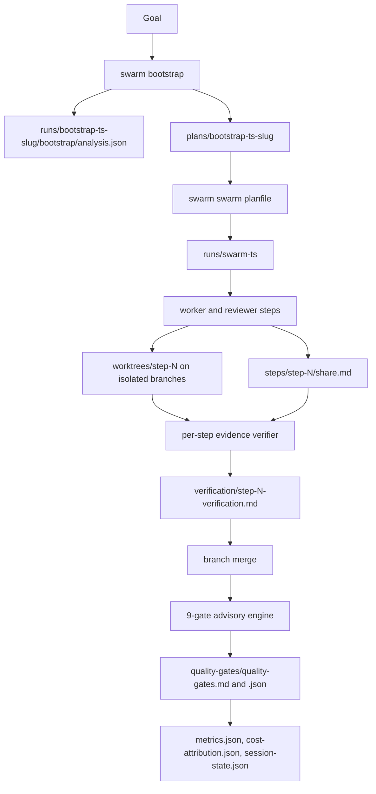

<div align="center">


# Swarm Orchestrator

End-to-end orchestration for AI coding agents: plan a goal, run isolated worker and reviewer steps, verify each step, merge the result, and write audit-ready run artifacts.

[](https://github.com/moonrunnerkc/swarm-orchestrator/actions/workflows/ci.yml)
[](https://github.com/moonrunnerkc/swarm-orchestrator/actions/workflows/continuous-benchmark.yml)


[](LICENSE)

</div>

## Table of contents

- [What it does](#what-it-does)
- [Anatomy of a run](#anatomy-of-a-run)
- [Install](#install)
- [Quick start](#quick-start)
- [Agents and roles](#agents-and-roles)
- [Verification model](#verification-model)
- [Quality gates](#quality-gates)
- [Configuration](#configuration)
- [Attestation](#attestation)
- [Benchmarks](#benchmarks)
- [CLI reference](#cli-reference)
- [Contributing](#contributing)

## What it does

Swarm Orchestrator turns a goal into a run: `swarm bootstrap` analyzes the target repo and writes a plan, then `swarm swarm <planfile>` runs worker and reviewer steps on isolated branches and worktrees. Each step captures a `/share` transcript, runs per-step verification, and merges only after the step verifier accepts the work.

After step branches merge, the 9-gate quality engine scans the merged result and writes a report. Gate findings are advisory today. They do not block the merge path in the current code.

The v7 verification direction is a five-layer falsification battery with signed in-toto attestations. That code exists under `src/verification/`, but the automatic per-step run path still uses the evidence verifier plus the advisory quality-gate report.

## Anatomy of a run



`swarm bootstrap <path> "Goal"` creates a bootstrap run under `runs/bootstrap-<timestamp>-<slug>/`, records repo analysis at `bootstrap/analysis.json`, and saves the generated plan under `plans/`. The bootstrap command parses repo paths and the goal; flags such as `--tool` are not used for analysis today. The agent CLI is selected when the plan is executed.

`swarm swarm <planfile>` opens `runs/swarm-<timestamp>/`, creates per-step branches named `swarm/<executionId>/step-N-<agent>`, and runs each worker or reviewer step in `worktrees/step-N/`. Step transcripts land at `steps/step-N/share.md`. Per-step verification writes Markdown reports to `verification/step-N-verification.md`; when a step passes, the branch is merged and the temporary worktree is cleaned up.

After the step loop completes, the quality-gate runner writes `quality-gates/quality-gates.md` and `quality-gates/quality-gates.json`. Post-run state lands beside those reports.

```text
runs/
  bootstrap-<timestamp>-<slug>/
    bootstrap/
      analysis.json
  swarm-<timestamp>/
    .context/
      shared-context.json
    steps/
      step-N/
        share.md
    worktrees/
      step-N/                  # present while a step is executing
    verification/
      step-N-verification.md
    quality-gates/
      quality-gates.md
      quality-gates.json
    metrics.json
    cost-attribution.json
    session-state.json
plans/
  bootstrap-<timestamp>-<slug>
```

The orchestrator may also create a transient `.locks/` directory inside the run when steps run in parallel; it serializes git operations across worktrees and is empty (or absent) for runs whose waves serialize naturally.

## Install

Prerequisites:

- Node.js 20 or newer for `swarm-orchestrator`.
- Git, with a clean enough worktree for branch and worktree operations.
- At least one supported agent CLI. GitHub Copilot CLI currently requires Node.js 22 or newer.

If you use Copilot CLI, the Node.js 22 requirement supersedes the Node.js 20 floor for `swarm-orchestrator` itself.

Build from source:

```bash
git clone https://github.com/moonrunnerkc/swarm-orchestrator.git
cd swarm-orchestrator
npm install
npm run build
npm link
swarm --help
```

Supported execution adapters:

| Adapter value | CLI package | Install | Auth |
| --- | --- | --- | --- |
| `copilot` | GitHub Copilot CLI | `npm install -g @github/copilot` | Run `copilot`, then `/login` |
| `claude-code` | Claude Code | `npm install -g @anthropic-ai/claude-code` | Run `claude` for browser login, or set `ANTHROPIC_API_KEY` |
| `claude-code-teams` | Claude Code | `npm install -g @anthropic-ai/claude-code` | Same auth as `claude-code`. The orchestrator dispatches one step at a time per adapter call; concurrency between steps is decided by the static dependency analyzer, not by an adapter team-size knob. |
| `codex` | Codex | `npm install -g @openai/codex` | Run `codex --login`, or set `OPENAI_API_KEY` |

## Quick start

The agent is selected on the execution command. `swarm bootstrap` prints the exact plan path; use that path in the follow-up `swarm swarm` command. The examples use `--yes` to skip the cost confirmation prompt.

```bash
# GitHub Copilot CLI
swarm bootstrap ./your-repo "Add JWT auth and role-based access control"
swarm swarm plans/bootstrap-<timestamp>-<slug> --tool copilot --yes
```

```bash
# Claude Code
swarm bootstrap ./your-repo "Add request logging and correlation IDs"
swarm swarm plans/bootstrap-<timestamp>-<slug> --tool claude-code --yes
```

```bash
# Codex
swarm bootstrap ./your-repo "Add a retry helper with tests"
swarm swarm plans/bootstrap-<timestamp>-<slug> --tool codex --yes
```

Inspect the newest swarm run from the same directory you ran `swarm swarm` in (the orchestrator resolves run paths relative to the cwd's `runs/`):

```bash
swarm status swarm-<timestamp>
swarm report --latest --format md --stdout
ls runs/swarm-<timestamp>
```

Typical bootstrap output includes the evidence path, plan path, and run id:

```text
Bootstrap Results:
  Evidence: runs/bootstrap-<timestamp>-<slug>/bootstrap/analysis.json
  Plan: plans/bootstrap-<timestamp>-<slug>
  Run ID: bootstrap-<timestamp>-<slug>
```

## Agents and roles

The default role config is [config/default-agents.yaml](config/default-agents.yaml). The v7 swarm flow uses two roles:

- Worker: writes implementation code, runs tests, commits changes, and does not edit pre-existing test files unless the goal explicitly authorizes it. The prompt is [agents/worker.agent.md](agents/worker.agent.md).
- Reviewer: read-only. It generates synthesized tests before worker execution and reviews diffs after worker execution. Security, accessibility, and general review modes are reviewer policies, not separate agent roles. The prompt is [agents/reviewer.agent.md](agents/reviewer.agent.md).

A small set of pre-v7 specialist personas (`backend_master`, `frontend_expert`, `tester_elite`, `devops_pro`, `security_auditor`, `integrator_finalizer`, `meta_reviewer`) is retained in `.github/agents/` because `swarm quick` and `swarm demo` still dispatch through them. They are not part of the swarm flow's default plan generation and will be retired with the quick-fix and demo modes.

## Verification model

The production path today has two parts. First, each step runs the evidence verifier in `src/verifier-engine.ts`: transcript parsing, running the test and build commands the transcript claims it ran, and git diff inspection. When the agent CLI loads hook files from `<gitRoot>/.github/hooks/` (currently only Copilot CLI), the verifier additionally cross-references the captured hook evidence; for the other adapters the cross-reference is suppressed. Second, after branches merge, `src/quality-gates/` writes a 9-gate advisory report for the merged result. Gate findings do not block the merge path today.

The v7 falsification battery is the direction for per-patch verification. Library code exists for all five layers plus composite scoring: fail-to-pass differential checks, regression plus mutation testing, cheat detection, property checks, and signed attestation. Any layer that reports `advisory-warn` or `fail` forces human review independently; the composite score reports overall confidence to the operator. Integration into the per-step flow is still in progress. The only currently exposed CLI surface from this package is `swarm attest verify <commit>`. Layer-by-layer details are in [docs/verification.md](docs/verification.md).

## Quality gates

The gate registry in `src/quality-gates/registry.ts` currently registers 9 gates. The runner writes advisory findings today; turning those findings into hard gates is a planned change, not current behavior.

| Gate (display name) | YAML key | What it checks |
| --- | --- | --- |
| `scaffold-defaults` | `scaffoldDefaults` | Flags default scaffold titles, placeholder files, generated README text, and tracked artifacts that should be ignored. |
| `duplicate-blocks` | `duplicateBlocks` | Finds repeated code blocks over the configured threshold and points to extraction candidates. |
| `hardcoded-config` | `hardcodedConfig` | Scans for hardcoded localhost URLs, retry counts, and similar config literals when no config file or environment variable is present. |
| `readme-claims` | `readmeClaims` | Checks configured README claims against required code evidence. |
| `test-isolation` | `testIsolation` | Detects JavaScript and TypeScript module-scope mutable stores without a reset strategy. |
| `runtime-checks` | `runtimeChecks` | Runs available project checks, including `npm test`, ESLint, and `npm audit` when the project config exists. |
| `accessibility` | `accessibility` | Checks HTML, JSX, and CSS for accessibility and UX signals such as landmarks, focus styles, alt text, reduced motion, and responsive CSS. |
| `test-coverage` | `testCoverage` | Checks that source files have matching or importing tests, test files contain assertions, and React projects have component tests. |
| `test-file-protection` | `testFileProtection` | Uses git diff from the base commit to flag edits to pre-existing test files. |

The display names in the gate report use the kebab form on the left; the YAML key in `.swarm/gates.yaml` accepts either spelling and normalizes both to the camelCase form on the right (the registry's canonical key).

Detailed gate docs are in [docs/quality-gates.md](docs/quality-gates.md). The shipped config example is [config/quality-gates.yaml](config/quality-gates.yaml).

## Configuration

Quality-gate config resolves in this order: built-in defaults, project `.swarm/gates.yaml`, explicit `--quality-gates-config`, then legacy `config/quality-gates.yaml` only when neither project nor explicit config was used.

The same `.swarm/gates.yaml` file can hold v7 verification thresholds and quality-gate options:

```yaml
verification:
  mutation:
    failBelow: 0.6
    warnBelow: 0.8
  composite:
    # Confidence threshold for reporting; advisory-warn or fail statuses force human review independently.
    threshold: 0.7
    weights:
      cheatDetector: 0.4
      propertyGate: 0.4
      attestation: 0.2
    advisoryGatePenalty: 0.02

gates:
  runtimeChecks:
    enabled: true
    timeoutMs: 30000
  duplicateBlocks:
    enabled: true
    minLines: 8
```

See [config/quality-gates.yaml](config/quality-gates.yaml) for the full shipped gate config shape and [src/quality-gates/config-loader.ts](src/quality-gates/config-loader.ts) for resolution behavior.

## Attestation

The in-toto envelope schema and cosign keyless signing helpers live in `src/verification/attestation.ts` and `src/verification/cosign-attestation.ts`. The envelope records the subject commit, goal hash, plan hash, agent identity, transcript hash, layer results, composite score, and timestamp.

The shipped CLI verifies an attestation git note:

```bash
swarm attest verify <commit>
```

Cosign keyless signing uses Fulcio and OIDC when the library signing path is called. Automatic per-step attestation generation during a run is part of the v7 falsification-battery integration and is not wired into the production run loop yet.

## Benchmarks

Benchmark docs and manifests live under [benchmarks/swe-bench/](benchmarks/swe-bench/) and [docs/benchmarks.md](docs/benchmarks.md). The 50-instance SWE-bench Verified sweep is still pending; recorded smoke runs are listed as smoke data, not as the final v7 benchmark. The Codex smoke row records rate limiting on the test account, so it should not be read as a Codex-versus-Copilot quality comparison.

| Run | Dataset | Tool | Result | Evidence |
| --- | --- | --- | --- | --- |
| 50-instance falsification sweep | SWE-bench Verified, seed 42, 50 instances | pending | pending | [instances-50.json](benchmarks/swe-bench/instances-50.json) |
| Copilot smoke, 2026-04-28 | SWE-bench Verified, 5 instances | `copilot` | 4/5 resolved, mean latency 996.55 seconds | [smoke-2026-04-28-copilot-results.json](benchmarks/swe-bench/results/smoke-2026-04-28-copilot-results.json) |
| Codex smoke, 2026-04-28 | SWE-bench Verified, 5 instances | `codex` | 0/5 resolved, mean latency 613.98 seconds, usage-limit failures recorded | [smoke-2026-04-28-codex-results.json](benchmarks/swe-bench/results/smoke-2026-04-28-codex-results.json) |

## CLI reference

Primary entry points are `bootstrap`, `swarm`, `run`, and `quick`. Full flag docs are in [docs/cli.md](docs/cli.md).

| Command | Purpose | Description |
| --- | --- | --- |
| `swarm bootstrap <path(s)> "Goal"` | Plan and setup | Analyze repo paths, write bootstrap evidence, and save a plan under `plans/`. |
| `swarm plan <goal>` | Plan and setup | Generate a local execution plan. |
| `swarm plan --copilot <goal>` | Plan and setup | Print a Copilot planning prompt. |
| `swarm plan import <runid> <transcript>` | Plan and setup | Parse a plan from a Copilot `/share` transcript. |
| `swarm execute <planfile>` | Execute | Run a sequential copy and paste execution guide. |
| `swarm swarm <planfile>` | Execute | Run the verified branch, worktree, transcript, verification, merge, and gate workflow. Concurrency is conditional: ready steps run together only when the static dependency analyzer clears them. |
| `swarm run --goal "..."` | Execute | Generate a plan and execute it in one command. |
| `swarm run <planfile>` | Execute | Execute an existing plan. |
| `swarm quick "task"` | Execute | Run the single-agent quick-fix path. |
| `swarm demo <scenario>` | Demo | Run a named demo scenario. |
| `swarm demo-fast` | Demo | Alias for `swarm demo demo-fast`. |
| `swarm demo list` | Demo | List available demo scenarios. |
| `swarm gates [path]` | Verification | Run the advisory quality-gate engine on a repo path. |
| `swarm status <run-id>` | Inspect | Show sequential or swarm session status. The id is the timestamp suffix on the `runs/swarm-<timestamp>/` directory. |
| `swarm templates` | Inspect | List plan templates. |
| `swarm share import <runid> <step> <agent> <path>` | Evidence | Import a `/share` transcript. |
| `swarm share context <runid> <step>` | Evidence | Show prior step context for transcript review. |
| `swarm audit <session-id>` | Reports | Generate a Markdown audit report. |
| `swarm metrics <session-id>` | Reports | Show session metrics. |
| `swarm agents export` | Agents | Export every registered agent's prompt file (worker, reviewer, plus the pre-v7 specialist personas in `.github/agents/`). |
| `swarm use <recipe>` | Recipes | Parameterize and execute a built-in recipe. |
| `swarm recipes` | Recipes | List built-in recipes. |
| `swarm recipe-info <name>` | Recipes | Show recipe details. |
| `swarm report <run-id>` | Reports | Generate report artifacts from a run directory. |
| `swarm attest verify <commit>` | Attestation | Verify an attestation git note for a commit. |

## Contributing

```bash
npm install
npm test
npm run build
```

Contribution guidelines are in [CONTRIBUTING.md](CONTRIBUTING.md).

### License

ISC, see [LICENSE](LICENSE). Built by [Bradley R. Kinnard](https://www.linkedin.com/in/brad-kinnard/).
