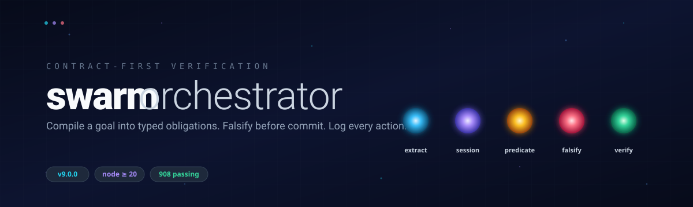

<div align="center">



<p>
  <a href="https://github.com/moonrunnerkc/swarm-orchestrator/actions/workflows/ci.yml"></a>
  <a href="https://github.com/moonrunnerkc/swarm-orchestrator/releases/latest"></a>
  <a href="LICENSE"></a>
  <a href="https://nodejs.org"></a>
  
  
  <a href="CONTRIBUTING.md"></a>
</p>

<p>
  <a href="#requirements"><b>Requirements</b></a> ·
  <a href="#install-from-a-clone"><b>Install</b></a> ·
  <a href="#quick-start"><b>Quick Start</b></a> ·
  <a href="#commands"><b>Commands</b></a> ·
  <a href="#providers"><b>Providers</b></a> ·
  <a href="#contracts"><b>Contracts</b></a> ·
  <a href="#verification"><b>Verification</b></a> ·
  <a href="#github-action"><b>GitHub Action</b></a> ·
  <a href="#project-map"><b>Map</b></a> ·
  <a href="#docs"><b>Docs</b></a> ·
  <a href="#development"><b>Dev</b></a>
</p>

</div>

---

# Swarm Orchestrator

Contract-first verification for code changes.

`swarm` turns a goal into typed obligations, verifies candidate patches against
those obligations, runs falsifiers, and records the run in a hash-chained JSONL
ledger. A patch is not accepted just because a model produced it.

Current release: `9.0.0`. The old v6 verified-branch pipeline was removed in
v9; pin `8.0.x` if you still need `swarm run --v6`. v8 is now the only runtime.
The old `swarm v8 <cmd>` form still works, but the normal commands are
unprefixed.

## Requirements

- Node `>=20`
- git `>=2.40`
- `npm`, `yarn`, or `pnpm` in target projects that run command obligations

## Install From A Clone

```bash
git clone https://github.com/moonrunnerkc/swarm-orchestrator.git
cd swarm-orchestrator
npm install
npm run build
npm link
```

Check the CLI:

```bash
swarm --help
```

## Quick Start

The default provider is `deterministic`: no model, no network, no API key. It
expects a hand-authored contract and an external patch source.

```bash
cat > contract.yaml <<'EOF'
obligations:
  - type: build-must-pass
    command: node -e "process.exit(0)"
  - type: test-must-pass
    command: node -e "process.exit(0)"
  - type: file-must-exist
    path: package.json
EOF

swarm compile "check project metadata exists" \
  --contract-file contract.yaml \
  --out .swarm/contracts/demo \
  --yes \
  --no-editor

printf '' > patches.jsonl

swarm run .swarm/contracts/demo \
  --external-patches-queue patches.jsonl \
  --falsifiers off
```

The empty queue is enough when the obligation is already true before patch
generation. For actual changes, write one JSON envelope per line:

```json
{"patch":"no-op","source":"manual"}
```

`patch` accepts one of three strict formats: whole-file blocks, unified diffs,
or the literal `no-op`.

## Commands

| Command | Purpose |
|---|---|
| `swarm compile <goal>` | Write `contract.jsonl` and `manifest.json` |
| `swarm run <contract-dir>` | Apply, verify, falsify, and ledger a compiled contract |
| `swarm run --goal "<text>"` | Compile and run in one step |
| `swarm resume <run-id>` | Continue from a prior ledger |
| `swarm stats <run-id>` | Summarize a run ledger |
| `swarm doctor` | Probe local prerequisites |

Run any command with `--help` for flags.

For deterministic one-step runs, pass the contract input through the wrapper:

```bash
swarm run --goal "check project metadata exists" \
  --contract-file contract.yaml \
  --external-patches-queue patches.jsonl
```

## Providers

Provider selection is per call:

`flag > env var > .swarm/config.yaml > deterministic`

| Provider | Use it when | Required setup |
|---|---|---|
| `deterministic` | Contracts and patches come from outside `swarm` | `--contract-file` or `--contract-module`, plus a patch dir, queue, or stdin |
| `local` | You run your own model endpoint | `LOCAL_LLM_BACKEND`, `LOCAL_LLM_BASE_URL`, and local model env vars |
| `anthropic` | You want hosted Claude generation | `ANTHROPIC_API_KEY` |

Supported local backends: OpenAI-compatible APIs, Ollama, llama.cpp, and vLLM.

Keep secrets in environment variables. Do not pass API keys through GitHub
Action inputs or committed config.

Provider details: [`docs/providers.md`](docs/providers.md).

## Contracts

Contracts are YAML, JSON, or a CommonJS-loadable module exporting:

```yaml
obligations:
  - type: build-must-pass
    command: npm run build
  - type: test-must-pass
    command: npm test
```

Supported obligation types:

- `file-must-exist`
- `build-must-pass`
- `test-must-pass`
- `function-must-have-signature`
- `property-must-hold`
- `import-graph-must-satisfy`
- `coverage-must-exceed`
- `performance-must-not-regress`

## Verification

A run can use pre-generation checks, streaming verification, post-generation
verification, falsifier adapters, rollback snapshots, and post-merge checks.
Confirmed falsifier failures roll back the workspace using snapshots under
`.swarm/snapshots/<run-id>/`.

Run artifacts:

```text
.swarm/contracts/<id>/contract.jsonl
.swarm/contracts/<id>/manifest.json
.swarm/ledger/<run-id>.jsonl
.swarm/snapshots/<run-id>/
```

Falsifier adapters live under `src/falsification/adapters/`. Defaults:

| Adapter | Default | Handles |
|---|---|---|
| Codex | on | `property-must-hold` |
| Copilot | on | `import-graph-must-satisfy`, `function-must-have-signature` |
| Claude Code | opt-in | `property-must-hold`, `import-graph-must-satisfy`, `function-must-have-signature` |

Disable adapter calls with `--falsifiers off`.

Falsifier details: [`docs/falsification-adapters.md`](docs/falsification-adapters.md).

## GitHub Action

The Docker action exposes the full provider, contract-source, and run-knob
surface as inputs. API keys are the one exception: they are read from the
workflow `env:` block, never from a `with:` input.

Natural-language goal with a hosted Claude provider:

```yaml
- uses: moonrunnerkc/swarm-orchestrator@v9
  with:
    goal: 'add a /health endpoint'
    extractor: anthropic
    session: anthropic
    model: claude-sonnet-4-6
  env:
    ANTHROPIC_API_KEY: ${{ secrets.ANTHROPIC_API_KEY }}
```

Pre-authored contract + deterministic patches (no LLM, no network):

```yaml
- uses: moonrunnerkc/swarm-orchestrator@v9
  with:
    goal: 'check project metadata exists'
    contract-file: ./swarm/contract.yaml
    external-patches-queue: ./swarm/patches.jsonl
    falsifiers: 'off'
```

Run an already-compiled contract directory:

```yaml
- uses: moonrunnerkc/swarm-orchestrator@v9
  with:
    contract-path: .swarm/contracts/release-gate
    session: deterministic
    external-patches-queue: ./swarm/patches.jsonl
```

Local-provider (e.g. Ollama running on a self-hosted runner):

```yaml
- uses: moonrunnerkc/swarm-orchestrator@v9
  with:
    goal: 'add a /health endpoint'
    extractor: local
    session: local
    local-backend: ollama
    local-base-url: http://localhost:11434/v1
    local-model-extractor: qwen2.5-coder:14b
    local-model-session: qwen2.5-coder:32b
```

Advanced flags not exposed as first-class inputs go through `extra-args`,
which is shell-split with quote awareness:

```yaml
- uses: moonrunnerkc/swarm-orchestrator@v9
  with:
    goal: 'add a /health endpoint'
    extra-args: '--snapshot-cleanup always --forbid-import lodash'
```

The action emits a `result` step output containing the run-result JSON
(obligations satisfied, tokens, wall time).

See [`action.yml`](action.yml) for the full input list and
[`SECURITY.md`](SECURITY.md) for secret-handling rules.

## Project Map

```text
src/cli/                 CLI dispatcher and v8 handlers
src/contract/            contract schema, compiler, validation, serialization
src/session/             deterministic, local, and Anthropic sessions
src/population/          candidate orchestration, apply, verify, rollback
src/verification/        obligation and streaming verifiers
src/falsification/       falsifier dispatch and adapter profiles
src/ledger/              append-only hash-chained ledger
src/inference/local/     local model backends
config/personas/         persona definitions
```

## Docs

- [`docs/providers.md`](docs/providers.md) - provider setup and env vars
- [`docs/migration.md`](docs/migration.md) - provider migration notes
- [`docs/falsification-adapters.md`](docs/falsification-adapters.md) - adapter subsystem
- [`CHANGELOG.md`](CHANGELOG.md) - release history
- [`CONTRIBUTING.md`](CONTRIBUTING.md) - development workflow
- [`SECURITY.md`](SECURITY.md) - vulnerability reporting and secret handling
- [`CLAUDE.md`](CLAUDE.md) - maintainer architecture notes

## Development

```bash
npm install
npm run build
npm test
npm run typecheck
```

License: [ISC](LICENSE).

<div align="center">
<sub>Built with the falsification gate. <a href="#swarm-orchestrator">↑ back to top</a></sub>
</div>
