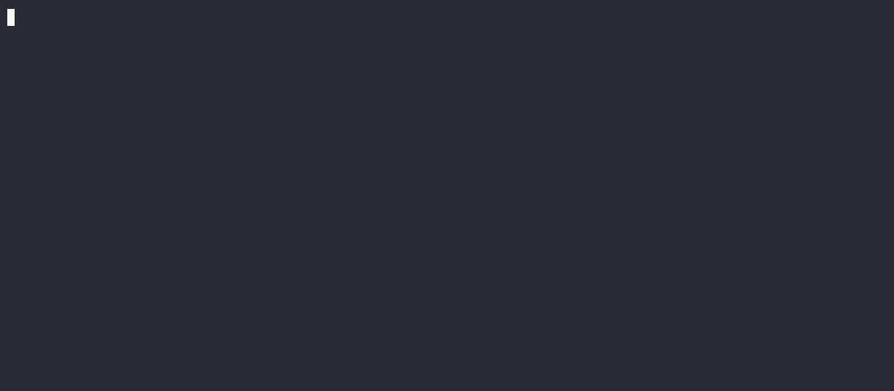

<a id="readme-top"></a>

<div align="center">

<h1>swarm-verify</h1>

<p><strong>Independently check what an AI-written change actually ran, whether the checks it passed could have caught wrong work, and what stays unverified.</strong></p>

</div>



```sh
npx swarm-verify
```

Run it in a repository. It discovers the declared test command from the manifests, runs it the
way a CI job would, and prints five conclusions apart: whether the command ran, what the checks
found, how the commands were contained, whether any requirement was judged, and whether any
check was challenged. A pass is a regression-only pass and is printed as one. Nothing is
written into the repository, and no model, key or configuration is needed.

Needs Node 22 or newer and git. Linux and macOS run every command; Windows runs bundle
verification. The recording above is a real run of the published package over the committed
bundle: verified, one byte of one record changed, refused with the reason
([transcript](docs/evidence/2026-09-27/verifier-first/tamper-demo-transcript.txt),
[script](docs/evidence/2026-09-27/verifier-first/tamper-demo.sh)).

[](https://github.com/moonrunnerkc/swarm-orchestrator/actions/workflows/gates.yml)
[](https://github.com/moonrunnerkc/swarm-orchestrator/actions/workflows/verifier-matrix.yml)
[](https://www.npmjs.com/package/swarm-verify)
[](LICENSE)

## In CI

One job, one Action, the permissions a signed comment needs
([the complete workflow](docs/examples/swarm-verification.yml)):

```yaml
name: swarm-verify
on:
  pull_request:
permissions:
  contents: read
  pull-requests: write
  id-token: write
  attestations: write
  artifact-metadata: write
jobs:
  verify:
    runs-on: ubuntu-latest
    steps:
      - uses: moonrunnerkc/swarm-verify@v1
```

The Action fetches the pull request's head and base by commit id into a checkout it owns, runs
the verification with candidate commands in a network-disabled container, signs the verdict as
a GitHub artifact attestation, and posts one comment bound to the head that says what was
measured and what was not. Forks and Dependabot have
[a documented trusted route](docs/examples/swarm-verification-forks.yml). Inputs, outputs and
how to verify a signed verdict from outside the run are in
[the broad-use guide](docs/broad-use.md#github-action).

## What it says, and what it does not

`regression: pass` means the repository's own checks passed on that exact tree. It does not
mean the work was done. Only a requirement contract can say that, and with one, `swarm-verify
ci --goal-contract` judges each requirement by its own check and, with `--challenges`, asks
whether that check could have caught wrong work: does it reject the tree before the change,
does it reject mechanical mutations of the change that the repository's own suite refuses,
does it reject a fixture sealed as a violation. A requirement whose check cannot be shown to
detect anything is reported as a gap, never as a pass.

Every run exports a bundle carrying its own dependency-free verifier. Integrity, signer
identity, execution trust, regression, task acceptance and challenge coverage are reported as
separate answers, and `unmeasured` is one of them.

## Where to go next

| You want to | Read |
| --- | --- |
| verify a patch, branch or pull request from any author, with a contract or without | [docs/verify-only.md](docs/verify-only.md), [docs/broad-use.md](docs/broad-use.md) |
| check what a bundle establishes, and who signed it | [docs/verify-only.md](docs/verify-only.md#swarm-verify-a-bundle-and-who-signed-it) |
| route an agent's test command through the ledger, from Claude Code, an MCP client or a git hook | [docs/integrations.md](docs/integrations.md) |
| every command, flag and exit code | [docs/cli.md](docs/cli.md) |
| every public claim and the artifact behind it, and what may not be said | [docs/claims.md](docs/claims.md) |
| the coding agent this verifier was built for, an advanced beta mode | [docs/agent.md](docs/agent.md) |
| the verifier-first campaign, its baseline, evidence and open items | [docs/verifier-first/README.md](docs/verifier-first/README.md) |

The full documentation index is [docs/README.md](docs/README.md).

## Contributing

The bar is the one the tool applies to itself: `npm run gates` green with the output shown, new
behaviour covered by a test that failed first, and no claim in a document that its linked artifact
does not establish.

1. Fork the project
2. Create a branch (`git checkout -b feature/amazing-feature`)
3. Run `npm run gates` and paste the real output in the pull request
4. Commit (`git commit -m 'Add an amazing feature'`)
5. Push (`git push origin feature/amazing-feature`)
6. Open a pull request

<p align="right">(<a href="#readme-top">back to top</a>)</p>
