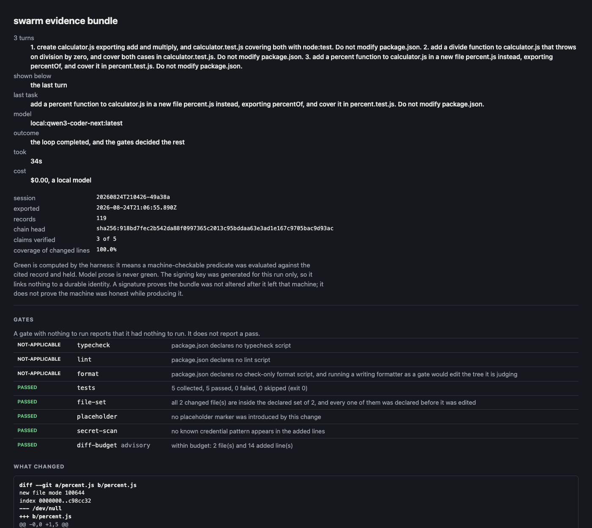

# Three tasks in one session, 2026-08-24

Not three runs of `swarm "task"`. One process, one ledger, three tasks typed one after another,
each one continuing the conversation the last one left. This is the record of the session
working end to end, and of the two defects found by running it that reading it would not have
shown.

The workspace was `~/projects/textcalc`: a git repository holding one `package.json` with a
`test` script and nothing else, so the gates had something real to measure and every file below
was written by the model.

    swarm --no-tui --max-steps 16 \
      --local-endpoint http://127.0.0.1:11434/v1 --model local:qwen3-coder-next:latest

Run from the tree that became 13.1.6. The two changes after it, an enter key that submits
whichever way the newline arrives and a screen that says a run changed nothing, are both about
what a terminal shows and neither touches what the gates measured here.

## The three turns

| | task | steps | changed | added | tests after |
| --- | --- | --- | --- | --- | --- |
| 1 | create `calculator.js` exporting add and multiply, and `calculator.test.js` covering both | 8 | 2 files | 24 | 2 collected, 2 passed |
| 2 | add a `divide` that throws on division by zero, and cover both cases | 10 | 2 files | 19 | 4 collected, 4 passed |
| 3 | add `percentOf` in a new `percent.js`, and cover it in `percent.test.js` | 6 | 2 files | 14 | 5 collected, 5 passed |

Read the "changed" column, because it is the whole reason the session needed building rather
than looping. Turn 1 left two files uncommitted. Turn 2 changed two more. Had the base stayed at
`HEAD`, turn 2's gates would have measured four files and charged the second turn with the
first's diff; turn 3 would have measured six. Each turn measured exactly its own two, because a
turn ends by writing a commit object naming the tree as it stands, and the next turn is measured
against that.

The test counts are the other half. They rise 2, 4, 5 and never fall, so the ratchet had
something to hold and held it. Turn 2 knew what `calculator.js` was without being told, which is
what carrying the conversation buys.

Every turn ran the whole gate set. `typecheck`, `lint` and `format` reported not-applicable
each time, because the workspace declares no such scripts, and a gate with nothing to run says
so rather than reporting a pass.

## The bundle

The whole session is one chain: `evidence/2026-08-24/session/`.

    $ cd /tmp && node .../session/verify.mjs .../session
      PASS  manifest reads: bundle format 1, session 20260824T210426-49a38a
      PASS  ledger parses: 119 of 119 lines
      PASS  record count matches the manifest: 119 records, manifest says 119
      PASS  hash chain intact: 119 links
      PASS  chain head matches the manifest: computed sha256:918bd7fec2b542da88f0997365c2013c95bddaa63e3ad1e167c9705bac9d93ac
      PASS  signature over the chain head verifies: ed25519, ephemeral key
      PASS  blobs match their content addresses: 104 blobs
      PASS  every record's payload is present: all payloads resolve
      PASS  claim verdicts recomputed: 3 verified, 2 unverified; manifest says 3 verified
    bundle verified: every check passed
    exit 0

Three verified claims, one per turn, and two the harness refused. Both numbers are on the face
of the page. Run from `/tmp`, against the copy committed here rather than the one under
`~/.swarm`, so nothing about the machine that produced it is in the path.

`keySource: ephemeral` for the reason the other records here give: the keychain entry on this
machine holds nine characters that are not an ed25519 key, and the run says so in a line rather
than signing quietly with something else.

## The page

The header used to open with the session id and the chain head. It now opens with what a person
actually asks: the tasks, the model, whether the loop completed, how long it took and what it
cost. `$0.00, a local model` is a real answer, and printing it beats leaving a zero to look like
a missing number.

Underneath it, two things that had never been on the page at all:

- **The gate table.** It existed only in the terminal, printed through the interface and never
  written into the bundle. On the page the gates had been a run of indistinguishable `gate-run`
  cards among the model calls, so the thing that decides the outcome was the hardest thing to
  find.
- **The diff.** Nothing in the system recorded a patch. The file-set record names files, the
  diff budget counts lines, and the tool calls hold fragments of edits, so the question the page
  exists to answer, what did this do to my code, could only be answered by leaving the evidence
  and running git. A task now records the diff it produced once the gates have settled, which is
  the state that was judged.

The header names all three tasks and says the gates and diff below are the last turn's, because
a session records one turn per `session-started` and showing the first task beside the last
turn's gates would describe two pieces of work as one.

## What running it found that reading it would not have

**A run that changed nothing reported `DONE`.** Found first with a model that answered `Not
Found` three times, and again with one that emitted its tool calls as text the protocol never
parsed. Both reach the gates having done nothing, and the second stops for the honest reason
`completed`. Every gate then passes over an empty diff, and the screen said `DONE gate
diff-budget: passed` in the success colour. Two fixes: the stop reason is now its own field that
gate events cannot overwrite, and a cycle that measured no changed files says so before the
table rather than after it.

**A session's second turn measured its own edits as deletions.** Caught by reading one number:
turn 2 reported `2 file(s) and 0 added line(s)` for a turn that had written a test. `git diff
<base>` taken from the person's own index calls a file that is in the base and untracked here
*deleted*, and the untracked pass then skipped it because the deletion had already claimed the
path. Changes are now measured through a scratch index, which makes the comparison tree to tree.

Neither is visible in the source. Both took running the thing.

## What this is not

- Not a measurement of how often a model succeeds. Three tasks on one model is a demonstration
  that the machinery works, not a rate. The distributions are in `calibration-report.md`.
- Not a claim that the local model is reliable. The same three tasks against
  `rapid-mlx`'s `qwen3-coder:30b-a3b` failed repeatedly, with the model emitting tool calls as
  text rather than through the protocol. The endpoint answers a short tool-calling prompt
  correctly, so the difference is the agent's larger prompt, and it is a fact about that pairing
  rather than about the harness. It is recorded here because a run that only reports its
  successes is the thing this project exists not to be.
